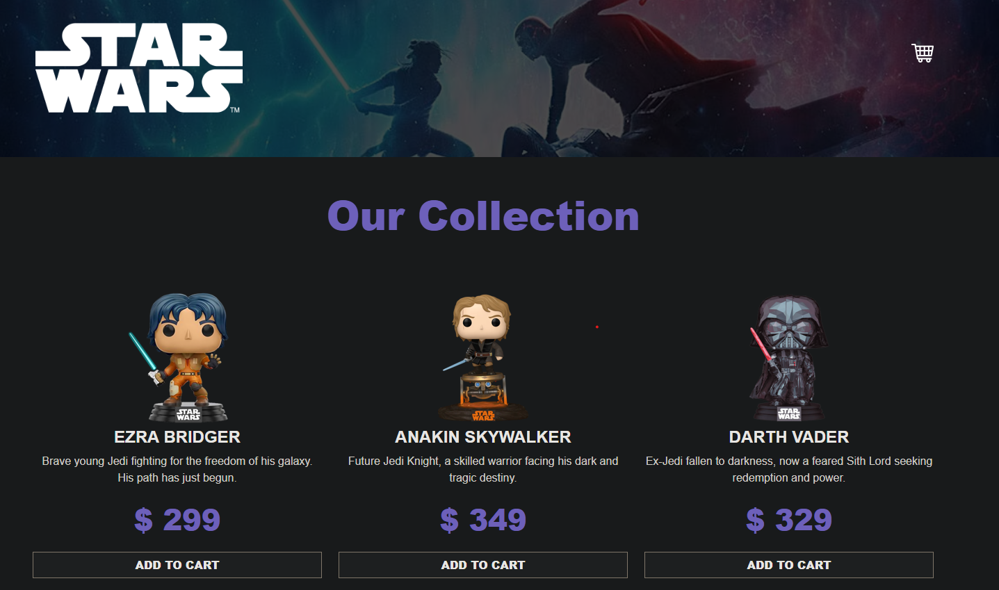
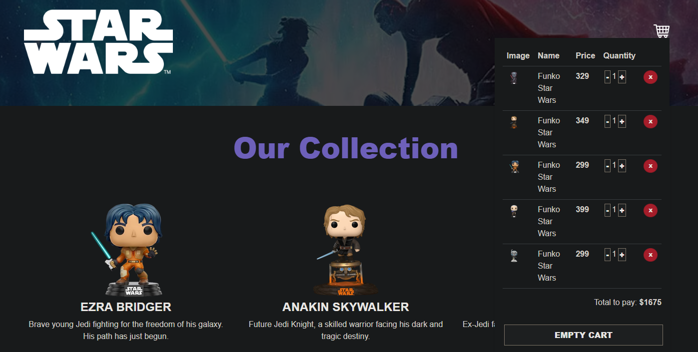

# FUNKO Shop Cart Flourwears

This project is an online Funko store created with React and Vite + Typescript.

## Project Setup

The project was created using Vite with the following configuration:

Configuration
```bash
npm create vite@latest
√ Project name: ... guitarla
√ Select a framework: » React
√ Select a variant: » Typescript + SWC
```

# Site Depoly by Netlify

```bash
https://clinquant-swan-1b49c4.netlify.app/
```

[](https://clinquant-swan-1b49c4.netlify.app/)


## Screenshots

### Main Screen



### Shopping Cart



## How to Run the Project Locally

1. Clone this repository
2. Navigate to the project directory
3. Install dependencies:
   ```bash
   npm install
   ```
4. Start the development server:
   ```bash
   npm run dev
   ```
5. Open your browser and visit `http://localhost:5173`


## Contributing

Contributions are welcome. Please open an issue or submit a pull request to suggest changes or improvements.


## License

[MIT](https://choosealicense.com/licenses/mit/)

# React + TypeScript + Vite

This template provides a minimal setup to get React working in Vite with HMR and some ESLint rules.

Currently, two official plugins are available:

- [@vitejs/plugin-react](https://github.com/vitejs/vite-plugin-react/blob/main/packages/plugin-react/README.md) uses [Babel](https://babeljs.io/) for Fast Refresh
- [@vitejs/plugin-react-swc](https://github.com/vitejs/vite-plugin-react-swc) uses [SWC](https://swc.rs/) for Fast Refresh